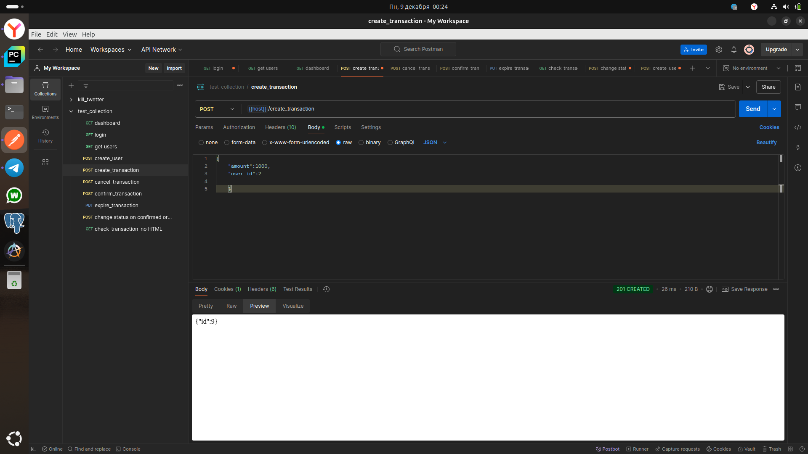

# API Transactions

#### Инстуркция по установке

1. ля запуска приложения необходимо указать переменное окружение

 ```bash
 pip install -r requirements.txt
 export PYTHONPATH=~/some_project/work_lib
 ```
2. Запустить команду
``` bash
    flask create-admin admin
```
Будет создан пользователь админ и немного данных в БД
3. Запуск самого приложения
```bash
    python app.py
```
4. Запуск celery
```bash
    docker run -d -p 6379:6379 redis
    celery -A celery_file.periodic_app worker --loglevel=info
    celery -A celery_file.periodic_app beat --loglevel=info
    celery -A app.celery flower


```
5. Проверка работы приложения 
http://localhost:5000
http://localhost:5555

ЭТо все запуск с командной строки в разных терминалах
# ЗАПУСК docker compose
```bash
 docker compose up -d --build
```
## Пример запроса на добавления транзакции 


